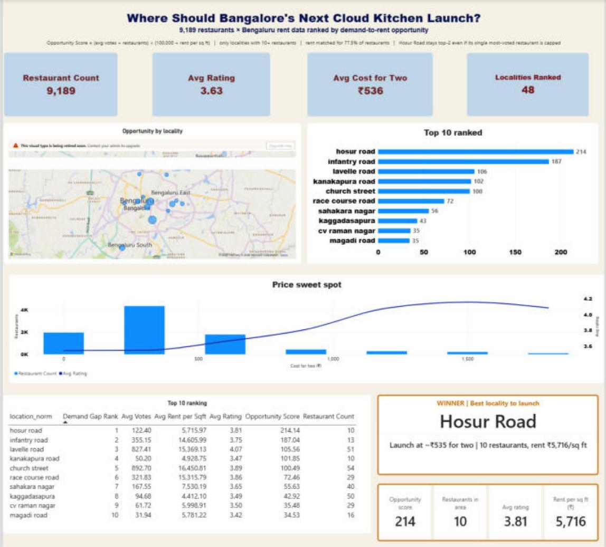

# Zomato Cloud Kitchen Opportunity Dashboard

**Portfolio project:** Power BI dashboard identifying high-opportunity localities for cloud kitchen launches in Bangalore.

## Features
- **Data cleaning pipeline** (`prep_data.py`): Zomato restaurant + Bengaluru house-price datasets → cleaned CSVs
- **Custom metric**: Opportunity Score = (avg votes ÷ restaurants) × (100,000 ÷ price per sq ft), with house sale price per sq ft as a proxy for rent
- **Interactive Power BI dashboard**: Ranks top 48 localities; includes map, bar chart, price sweet-spot analysis, top-10 table, and winner card for Hosur Road
- **Small-sample bias guard**: Localities ranked only if 10+ restaurants (avoids inflated scores from 1–2 entries)
- **Data honesty**: 77.5% of restaurants rent-matched; unmatched ones shown as null in Power BI

## Files
- `prep_data.py` — Data cleaning script (mojibake reversal, locality normalization, join)
- `powerbi_python_script.py` — Python connector for Power BI (loads cleaned CSVs)
- `data/restaurants_clean.csv` — 9,189 cleaned restaurant records
- `data/locality_clean.csv` — 60 matched localities with avg rent
- `Zomato Cloud Kitchen Opportunity Dashboard.pbix` — Power BI dashboard

## How to use
1. Run `python prep_data.py` to regenerate cleaned CSVs from raw data
2. Open the .pbix file in Power BI Desktop
3. Refresh Python data source (Data → Refresh all)
4. Explore dashboard visuals

## Key findings
**Top 3 unfiltered** (raw scores, no minimum-restaurant guard):
- Rajarajeshwari Nagar: score 1332 (2 restaurants) → excluded after 10+ guard
- Kengeri: score 910 (1 restaurant) → excluded
- Langford Town: score 747 (2 restaurants) → excluded

**Top 5 after 10+ guard** (48 valid localities):

| # | Locality | Score | Restaurants | Avg votes | Price/sq ft |
|---|---|---|---|---|---|
| 1 | Hosur Road | 214.1 | 10 | 122 | ₹5,716 |
| 2 | Infantry Road | 187.0 | 13 | 355 | ₹14,606 |
| 3 | Lavelle Road | 105.6 | 51 | 827 | ₹15,369 |
| 4 | Kanakapura Road | 101.9 | 10 | 50 | ₹4,929 |
| 5 | Church Street | 100.5 | 54 | 893 | ₹16,451 |

**Sensitivity to the minimum-restaurant cutoff:** the winner depends on it. Hosur Road has exactly 10 restaurants.

| Minimum restaurants | Winner | Localities ranked |
|---|---|---|
| 5 | Koramangala (232.6) | 53 |
| 10 | Hosur Road (214.1) | 48 |
| 15, 20, 30 | Lavelle Road (105.6) | 45, 43, 40 |

**Recommendation**: shortlist rather than a single pick. Hosur Road is the best low-cost option (few competitors, ₹5,716/sq ft, avg rating 3.81) but rests on a small sample. Lavelle Road wins under any stricter cutoff and has strong demand. Validate both with commercial rents and delivery order data before choosing.

**Limitations**: house sale price per sq ft stands in for commercial rent; votes are cumulative and stand in for delivery demand; the Zomato data is from about 2019.

## Technical notes
- Mojibake corruption fixed: 68 restaurant names were UTF-8/Latin-1 double-encoded; reversed via iterative `.encode("latin-1").decode("utf-8")` chain + cp1252 byte replacements
- Locality join: Zomato uses coarse locality names (e.g. "Hosur Road"); matched to finer house-price localities via substring matching
- Page background: Cream (#F6F1E7); map banner ("visual retiring") overlaid with white rectangle; no Azure Maps upgrade needed

---

**Author:** Prabh Singh  
**Built with:** Python (pandas, regex), Power BI Desktop  
**Data source:** Kaggle (Zomato Bangalore Restaurants, Bengaluru House Prices)
